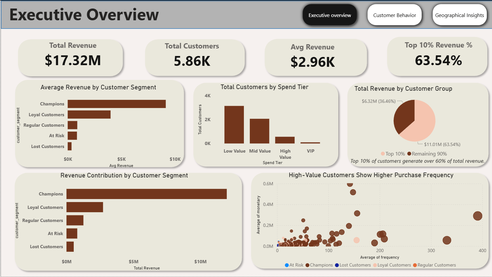
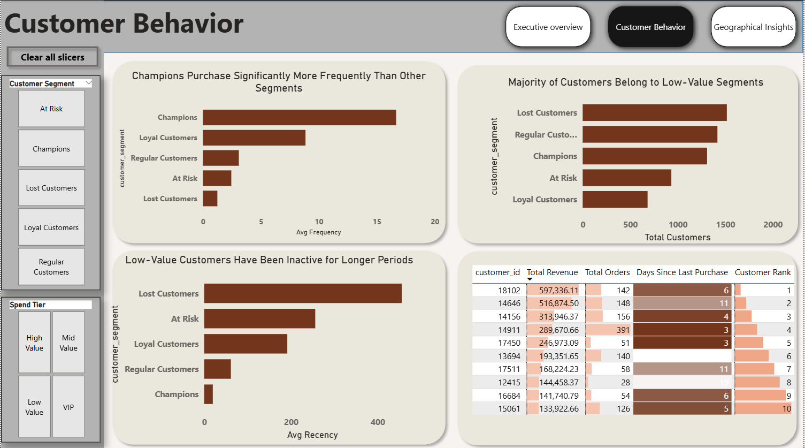
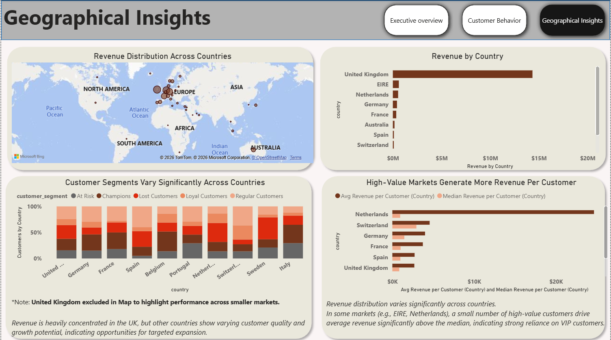

# Customer Segmentation & Revenue Analysis (RFM)
## 📌Project Overview

This project analyzes over **1 million retail transactions** to uncover what most dashboards miss:

👉 Not just how much revenue was generated —  
👉 But *which customers actually drive it* and where the risks lie.

Using **RFM segmentation (Recency, Frequency, Monetary)** and an interactive Power BI dashboard, this project provides a complete view of customer behavior and business performance.

## 🎯 Business Objective

Most dashboards answer *“how much?”*  
But decision-makers need to know:

- Who contributes the most value
- Whether revenue is concentrated or diversified
- Which customers are at risk of churn
- Where growth opportunities exist

This project bridges that gap by combining customer segmentation + behavioral + geographic analysis.

## 🧹 Data Cleaning (SQL)

Performed in PostgreSQL:

- Removed cancelled transactions
- Filtered negative quantities (returns)
- Created **Revenue = Quantity × Unit Price**
- Ensured valid customer IDs

Final dataset: **~793,000 clean records**
## 🧠 SQL Pipeline (RFM Logic)

The segmentation was built using a multi-step SQL pipeline:

1. Data Cleaning → remove invalid transactions  
2. Base Table → customer-level aggregation  
3. RFM Scoring → assign recency, frequency, monetary scores  
4. Segmentation → classify customers into business segments  
5. Final Table → optimized for Power BI  

📂 View full SQL scripts 👉 [rfm_analysis](rfm_analysis/)

## ⚙️ Feature Engineering (RFM)

Customer-level metrics:

- **Recency** → Days since last purchase
- **Frequency**→ Number of orders
- **Monetary** → Total revenue per customer

Customers were then segmented into:
- Champions
- Loyal Customers
- Regular Customers
- At Risk
- Lost Customers

📊 Dashboard Overview

### 🟢 Page 1 — Executive Overview

[View My Interactive Dashboard here](Customer_segmention_Analysis.pbix)
## ▶️ How to Use

1. Download the `.pbix` file from the repository
2. Open in Power BI Desktop
3. Use slicers to explore:
   - Customer Segment
   - Spend Tier
   - Country

Provides a high-level summary:

- Total Revenue, Customers, Avg Revenue
- Revenue contribution by segment
- Top 10% customer contribution
- Spend distribution

### 🔵 Page 2 — Customer Behavior

Explains why revenue behaves the way it does:

- Purchase frequency by segment
- Recency (customer activity levels)
- Top customers ranking
- Customer distribution across segments

### 🟠 Page 3 — Geographic Revenue Analysis

This page answers: *Where is revenue coming from, and where should we expand?*

- Revenue by country (map + ranking)
- Customer segment distribution by country
- Avg vs Median revenue comparison

⚠️ *Note: United Kingdom excluded in some visuals to reveal patterns in smaller markets.*

### 🔍 Key Insights
**💰 Revenue is highly concentrated**
- Top 10% of customers generate ~63% of revenue
- Business depends heavily on a small group of customers

**👑 High-value customers behave differently**
- Champions purchase more frequently
- They are also more recently active
- Strong link between frequency and revenue

**📉 Most customers are low-value**
- Majority fall into low or mid-value tiers
- Long inactivity among low-value segments

**Geographic imbalance**
- Revenue heavily concentrated in the UK
- Other countries show mixed performance and opportunity.

### ⚠️ Hidden risk (Advanced Insight)
- In some countries: **Average >> Median revenue**
- Indicates reliance on a few high-spending customers

👉 Suggests potential **revenue instability**

### Business Recommendations
- Focus retention on **top 10% customers**
- Re-engage **at-risk and inactive segments**
- Reduce dependency on a small group of customers
- Expand in **high-potential international markets**
- Monitor revenue distribution (avg vs median)

## 📐 Data Modeling

The project uses a **customer-level aggregated model (RFM table)**:

- Fact table: Transaction-level data (retail_clean)
- Aggregated table: Customer-level metrics (rfm_final)
- Relationship: Customer ID

This ensures:
- Efficient calculations
- Clean segmentation logic
- Scalable dashboard performance

### 🛠️ Tools & Technologies
- SQL (PostgreSQL) → Data cleaning & transformation
- Power BI → Dashboard & visualization
- DAX → Measures, ranking, segmentation

### 🚀 Skills Demonstrated
- Data Cleaning & Preparation
- SQL (CTEs, Aggregations, Window Functions)
- Data Modeling
- DAX (advanced calculations & segmentation)
- Dashboard Design & Storytelling
- Business Insight Generation

## 🔥 What Makes This Project Different

- Goes beyond revenue → identifies **who drives revenue**
- Combines **behavioral + geographic analysis**
- Highlights hidden risk using **Average vs Median comparison**
- Designed for **executive decision-making**, not just reporting