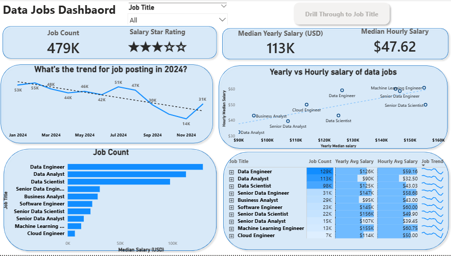
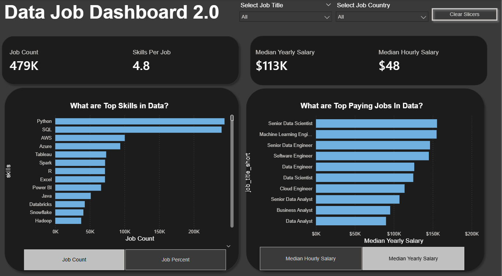

# Power BI Dashboard Portfolio
Welcome! This repository showcases a collection of Power BI dashboards I’ve built as part of my data analytics learning journey. The projects range from foundational reports to more advanced, interactive dashboards, all focused on transforming raw data into clear and meaningful insights that support decision-making.

## Feature Dashboards
Below are selected dashboards from this portfolio. Each project includes its own README file that explains the data source, modeling approach, analytical steps, and key insights derived from the dashboard.

### 📈 Data Jobs Dashboard (V1 – Comprehensive Analysis)

## Key Power BI Skills Applied

- 🎨 Dashboard layout and visual design best practices  
- 🔄 Power Query for ETL and data transformation  
- 🧩 Fundamental data modeling and table relationships  
- 🧮 Use of implicit measures and standard aggregations  
- 📊 Core visualizations (bar, line, area, and column charts)  
- 🗺️ Map visuals for location-based analysis  
- 📌 KPI cards and detailed tables for performance tracking  
- 🎛️ Interactive slicers to enable dynamic filtering  
- 🔖 Buttons and bookmarks for intuitive page navigation  
- 🔍 Drill-through functionality for deeper data exploration  

<<<<<<< HEAD
➡️ **[View full Project 1 documentation](Data_Job_v1\README.md)**

## Data Jobs Dashboard 2.0 (V2 Single page Focus)

[View Interactive Dashboard Here](Data_job_v2\Data_Jobs_2.0.pbix)

## Key Power BI Skills Utilized

- Advanced dashboard design with a focus on single‑page user experience and optimization  
- Complex Power Query transformations for robust data preparation  
- Star schema data modeling following best‑practice principles  
- Explicit DAX measure creation, including functions like CALCULATE and other context modifiers  
- Dynamic visualizations driven by parameters and slicers  
- Field and numeric parameter usage to support flexible “what‑if” analysis  
- Enhanced geospatial insights through map‑based visuals  
- Advanced card visualizations for clear KPI communication  
- Optimized slicers and refined cross‑filtering interactions  
- Report performance tuning and optimization considerations  

[**View Project 2 Details (README)**](Data_job_v2\README.md)

## About This Portfolio

Each dashboard in this portfolio includes its own dedicated `README.md` within its project folder. These documents provide deeper insight into the project goals, data sources, Power BI techniques used, and a closer look at how each dashboard was built.

=======
➡️ **[View full Project 1 documentation](./Data_Job_v1/README.md)**
>>>>>>> e5f4110459fc86b13404d1cad5d5d01cf4cb80dc
