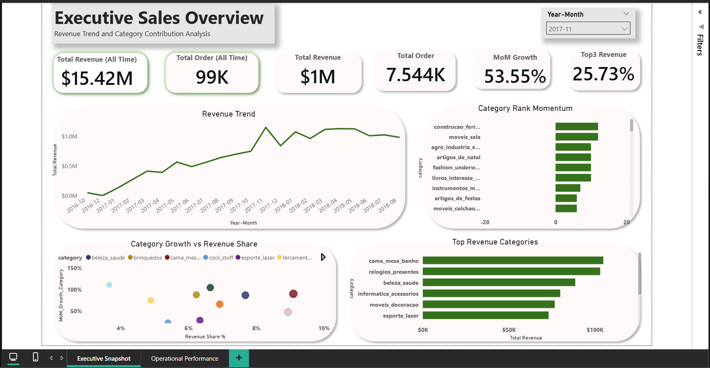
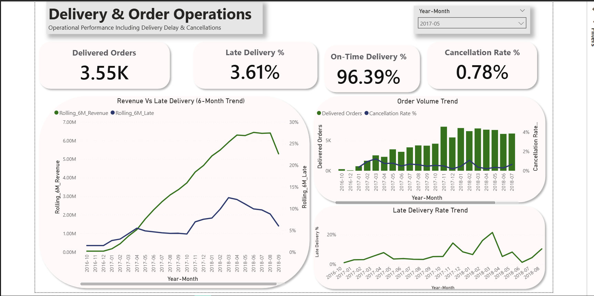

# E-Commerce Sales & Operational Performance Dashboard

This project analyzes e-commerce sales and delivery performance using SQL and Power BI to provide executive and operational insights into revenue trends, category performance, and logistics efficiency.

## Executive Sales Overview

## Operational Performance

## Business Problem

E-commerce companies need clear visibility into both revenue performance and operational delivery efficiency.

This dashboard helps answer key business questions:

- How is revenue trending over time?
- Which product categories contribute the most revenue?
- Which categories are gaining or losing market momentum?
- Are delivery delays increasing?
- How do cancellations relate to order volume?

## Dataset

The dataset contains historical e-commerce orders including:

- Order purchase timestamps
- Delivery dates
- Estimated delivery dates
- Order status
- Product categories
- Revenue per order

The data was transformed using SQL before being loaded into Power BI for analysis.

## Key Metrics

The dashboard tracks several important KPIs:

- Total Revenue
- Total Orders
- Month-over-Month Growth
- Top 3 Category Revenue Share
- Late Delivery Rate
- On-Time Delivery Rate
- Cancellation Rate

## Tools Used

- SQL – Data transformation and aggregation
- Power BI – Data modeling and visualization
- DAX – KPI calculations and time intelligence
- GitHub – Project documentation and portfolio hosting

## Skills Demonstrated

This project demonstrates several key data analytics skills:

**Data Analysis**
- Business KPI identification
- Category performance analysis
- Time-series trend analysis
- Operational performance monitoring

**SQL**
- Data aggregation and transformation
- Category-level performance calculations
- Ranking and window functions

**Power BI**
- Data modeling with relationships
- DAX calculations for KPIs and growth metrics
- Interactive dashboard design
- Executive and operational reporting

**Data Visualization**
- KPI cards and executive metrics
- Trend analysis using line charts
- Scatter plot analysis for growth vs revenue share
- Category ranking and contribution analysis

## Key Insights

- Revenue shows a consistent upward trend across the dataset.
- A small number of categories contribute a large share of total revenue.
- Some categories demonstrate strong revenue share but slower growth, indicating mature product segments.
- Delivery delays fluctuate across months and require operational monitoring.
- Cancellation rates remain relatively low compared to overall order volume.

## Conclusion

The analysis shows that overall revenue has grown steadily over time, with a small number of product categories contributing the majority of total sales. Category-level analysis reveals differences in both revenue share and growth momentum, highlighting opportunities to focus on high-performing segments while monitoring categories losing market rank.

Operational metrics indicate that most orders are delivered on time, with late delivery and cancellation rates remaining relatively low relative to total order volume. However, fluctuations in late delivery trends suggest the need for continuous operational monitoring to maintain service reliability as order volume grows.

## Recommendations

Based on the analysis, the following actions may help improve business performance:

- **Prioritize high-growth categories:** Focus marketing and inventory investment on categories showing both strong revenue share and positive growth momentum.

- **Monitor declining categories:** Categories losing rank should be evaluated for pricing, demand changes, or inventory constraints.

- **Improve delivery monitoring:** Although late deliveries remain relatively low, spikes in certain months indicate opportunities to improve logistics tracking and fulfillment planning.

- **Track operational KPIs regularly:** Integrating delivery performance metrics into operational reviews can help identify issues early and maintain customer satisfaction as order volumes increase.

